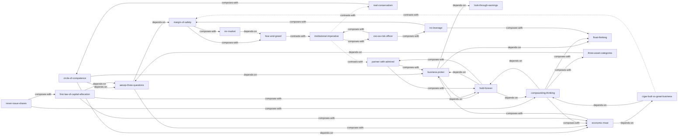

# 《巴菲特致股东的信》 — Skill Index

> 本书由 book2skill (cangjie-skill) 蒸馏, 共产出 **20** 个 skills。
> 处理时间: 2026-04-16

## 关于这本书

- **作者**: 沃伦·巴菲特 (Warren Buffett)
- **时间跨度**: 1957-2023 (合伙基金时期 + 伯克希尔时期)
- **一句话主旨**: 以企业所有者视角做投资决策，用独立理性对抗系统性非理性
- **整书理解**: 见 [BOOK_OVERVIEW.md](./BOOK_OVERVIEW.md)

---

## Skill 列表 (按主题分组)

### 投资哲学基础

- [`circle-of-competence`](./circle-of-competence/SKILL.md) — 能力圈判断：知道边界在哪比圈的大小更重要
- [`mr-market`](./mr-market/SKILL.md) — 市场先生思维：市场为你服务而非指导你
- [`business-picker`](./business-picker/SKILL.md) — 做生意不做股票：用评估私有企业的标准选股
- [`real-conservatism`](./real-conservatism/SKILL.md) — 保守≠传统：真正的保守来自知识和理性

### 估值与定价

- [`aesop-three-questions`](./aesop-three-questions/SKILL.md) — 伊索三问：灌木丛里有几只鸟？什么时候出现？确定性多大？
- [`margin-of-safety`](./margin-of-safety/SKILL.md) — 安全边际：买入价远低于价值，为错误留余地
- [`look-through-earnings`](./look-through-earnings/SKILL.md) — 透视盈余：看穿会计数字，理解真实经济收益
- [`three-asset-categories`](./three-asset-categories/SKILL.md) — 三类投资分类法：货币性/非生产性/生产性资产的长期竞赛

### 企业质量

- [`economic-moat`](./economic-moat/SKILL.md) — 经济商誉/护城河：识别以极少资本持续增长利润的企业
- [`cigar-butt-vs-great-business`](./cigar-butt-vs-great-business/SKILL.md) — 雪茄蒂vs伟大企业：合理价买好企业远胜于低价买差企业
- [`float-thinking`](./float-thinking/SKILL.md) — 浮存金思维：寻找"别人付钱让你用他们的钱"的模式

### 行为与心理

- [`fear-and-greed`](./fear-and-greed/SKILL.md) — 恐惧与贪婪逆向：别人恐惧时贪婪，别人贪婪时恐惧
- [`institutional-imperative`](./institutional-imperative/SKILL.md) — 机构强制力：识别管理者模仿同行愚蠢倾向的系统性力量

### 资本配置

- [`first-law-of-capital-allocation`](./first-law-of-capital-allocation/SKILL.md) — 资本配置第一法则：1美元留存收益是否创造了超过1美元的市场价值
- [`hold-forever`](./hold-forever/SKILL.md) — 永久持有：卖出优秀企业=放弃复利引擎
- [`never-issue-shares`](./never-issue-shares/SKILL.md) — 不用股票收购：用自家股票收购=放弃未来复利力量
- [`compounding-thinking`](./compounding-thinking/SKILL.md) — 复利思维：小差异×长时间=巨大差距，少数赢家的长期绽放

### 风险管理

- [`no-leverage`](./no-leverage/SKILL.md) — 不用杠杆/财务堡垒：任何正数乘以零永远等于零
- [`ceo-as-risk-officer`](./ceo-as-risk-officer/SKILL.md) — CEO=首席风险官：CEO的风险责任不可委托

### 人际与信任

- [`partner-with-admired`](./partner-with-admired/SKILL.md) — 只与喜欢和钦佩的人合作：宁取100%X配好关系，不要110%X配差关系

---

## 引用图



图例:
- `-->` depends-on
- `-.->` contrasts-with
- `===>` composes-with

---

## 推荐学习顺序

(从依赖图的叶子节点开始, 向上)

**第一层 — 基础（无前置依赖）**
1. **circle-of-competence** — 能力圈，一切分析的起点
2. **real-conservatism** — 独立思考，对抗从众心理

**第二层 — 核心框架**
3. **business-picker** — 买企业不买股票的思维转换
4. **aesop-three-questions** — 内在价值评估的核心工具
5. **mr-market** — 理解市场波动的本质

**第三层 — 估值与质量**
6. **margin-of-safety** — 为错误留余地
7. **economic-moat** — 识别伟大企业
8. **look-through-earnings** — 看穿会计数字
9. **float-thinking** — 低成本杠杆的秘密

**第四层 — 行为与策略**
10. **fear-and-greed** — 逆向行动的勇气
11. **compounding-thinking** — 时间和复利的力量
12. **cigar-butt-vs-great-business** — 方法论的进化
13. **three-asset-categories** — 跨资产类别思考
14. **institutional-imperative** — 识别系统性非理性

**第五层 — 执行**
15. **hold-forever** — 永久持有的执行策略
16. **first-law-of-capital-allocation** — 资本配置决策
17. **partner-with-admired** — 选择合作伙伴
18. **never-issue-shares** — 收购支付方式

**第六层 — 风险管理**
19. **no-leverage** — 财务堡垒
20. **ceo-as-risk-officer** — CEO的风险责任

---

## 接入 darwin-skill

所有 skill 均带有 `test-prompts.json` (darwin-skill 兼容格式), 可直接接入自动进化:

```
darwin evolve books/buffett-letters/
```

---

## 审计轨迹

- 候选单元池: [candidates/](./candidates/)
- 三重验证通过: [verified.md](./verified.md)
- 被淘汰的候选 (含原因): [rejected/](./rejected/)
- BOOK_OVERVIEW: [BOOK_OVERVIEW.md](./BOOK_OVERVIEW.md)
